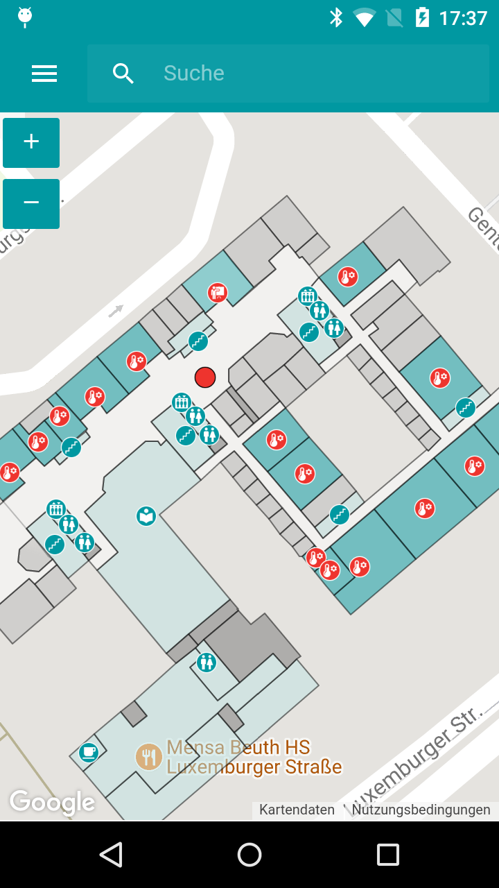
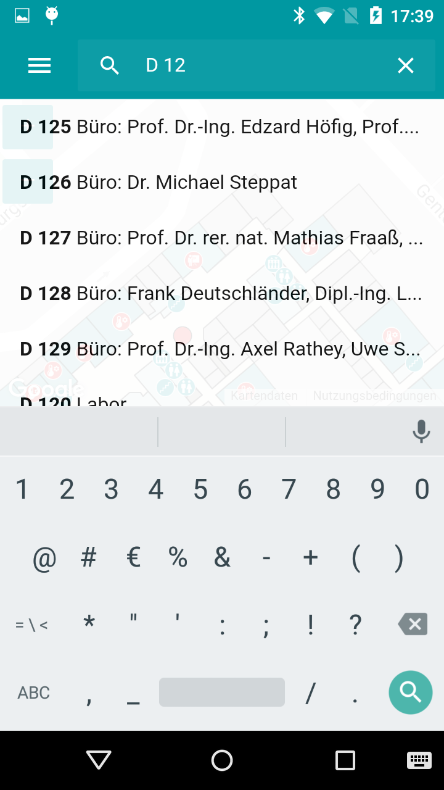
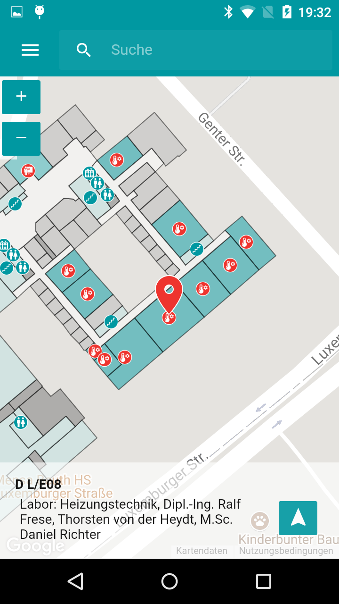
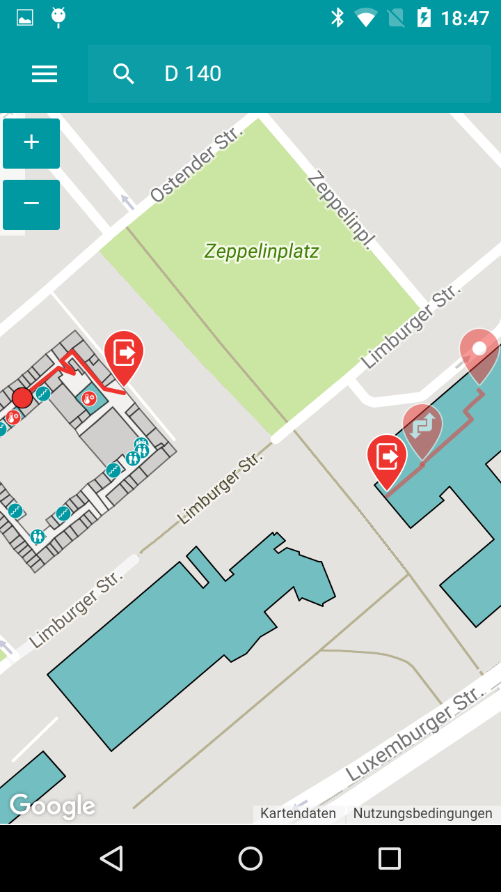

# ionic2-beuthnav
<h3><b>Indoor Navigation Hybrid Application using Beacons Bluetooth Low Energy technology.</b></h3>

<b>Reconsiled determination of position via Kalman filtering. Surveyed indoor data displayed on Google Maps API. </b>

<b>Integrated SearchListView with name filtering using a SQLite database connection. </b>

<b>Calculation of determined users route using the Funnel algorithm to navigate through declared polygons. Supports multiple floor layer navigation with live feedback. </b>

